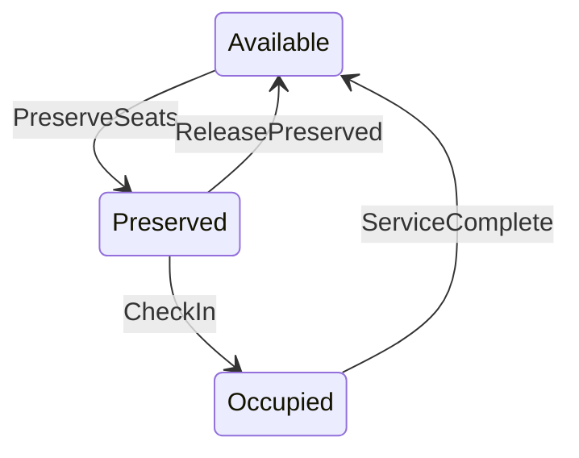
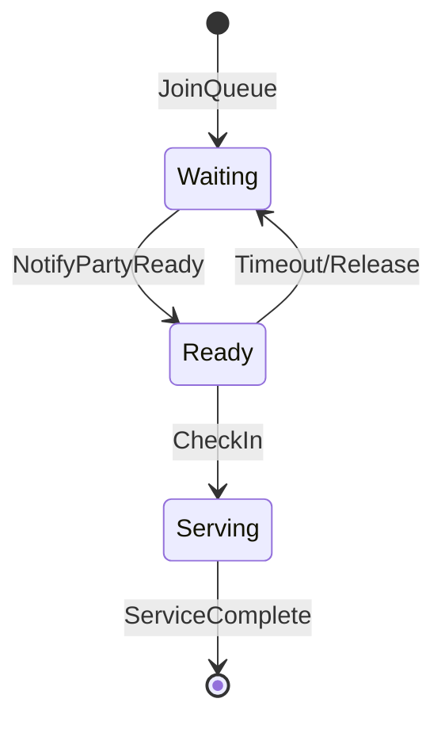
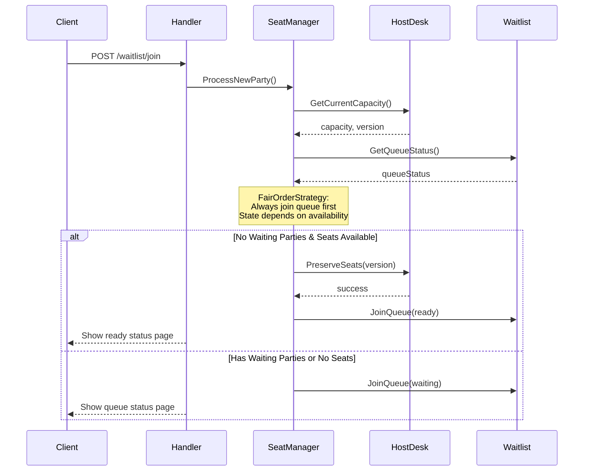
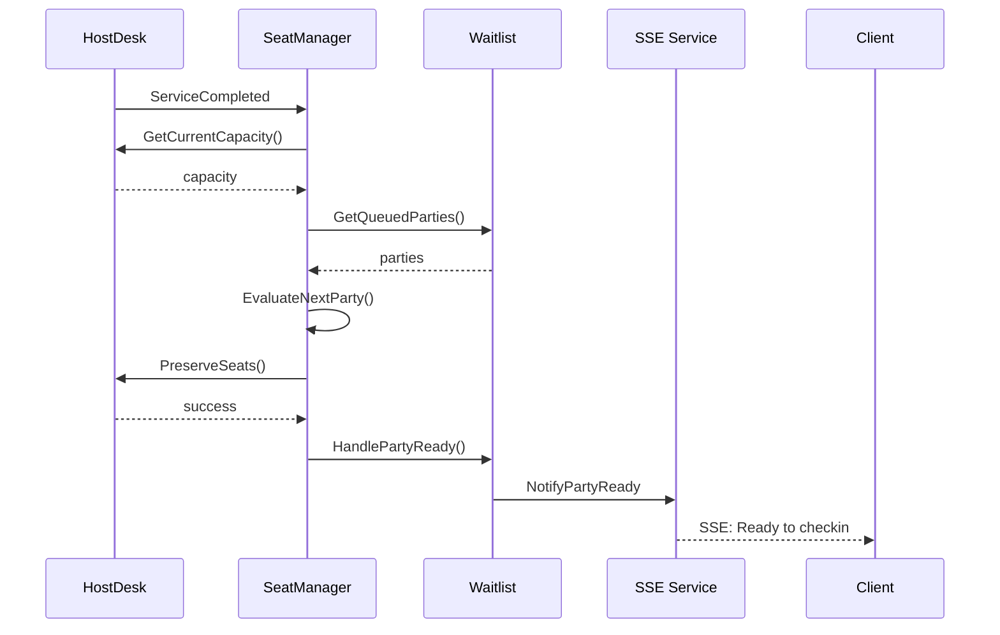
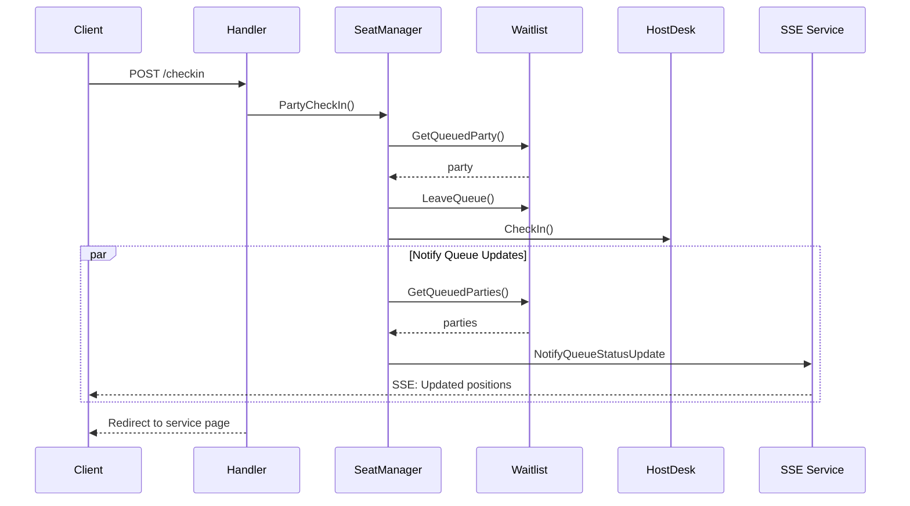
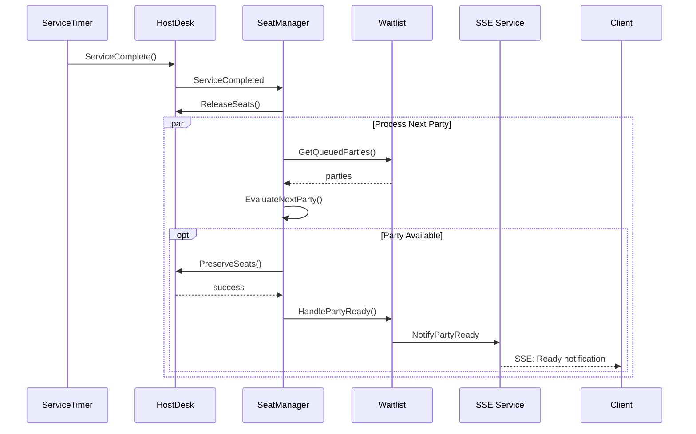

# Queue-Bite: Restaurant Queue Management System

A distributed queue management system for restaurants, handling waitlist management, seating orchestration, and real-time status updates.

## Requirements

### Functional Requirements

1. **Queue Management**
  - Join waitlist with party details (name, size)
  - View current queue position
  - Real-time position updates
  - Leave queue functionality
  - Queue status display for visitors

2. **Seating Management**
  - Track restaurant capacity
  - Preserve seats for parties
  - Check-in process
  - Service completion handling

3. **Real-time Updates**
  - Party status notifications
  - Queue position changes
  - Ready-to-seat alerts

### Non-Functional Requirements

1. **Performance**
  - Handle concurrent queue operations
  - Efficient wait time calculations
  - Responsive real-time updates

2. **Scalability**
  - Support for high queue volumes
  - Distributed event processing
  - Efficient resource usage

3. **Reliability**
  - Consistent queue state
  - Accurate capacity tracking
  - Resilient to failures

## Screen Records


1. Party joining queue
2. Queue status updates
3. Check-in process
4. Real-time notifications

## Running the Application

### Prerequisites
- [Go 1.22 or higher](https://go.dev/doc/install)
- Docker and Docker Compose
- Make

### Quick Start
```bash
# Clone repository
git clone https://github.com/bahaha/queue-bite.git
cd queue-bite

# Run with Docker
make docker-run

# Application will be available at http://localhost:55666
```

## Local Development
```bash
# Install dependencies
go mod download

# Run application, will start the redis defined in the docker compose
make watch
```

## System Design

### Domain Driven Design Modules
1. Waitlist Context
    - Responsibility: Queue management and state
    - Key Components:
      + Queue operations (join/leave)
      + Position tracking
      + Wait time calculations

2. HostDesk Context
    - Responsibility: Seating and capacity management
    - Key Components:
      + Capacity tracking
      + Seat preservation
      + Service state management
    - Events Emitted:
      + SeatsPreserved
      + ServiceCompleted

3. SeatManager Context
    - Responsibility: Orchestration between Waitlist and HostDesk
    - Key Components:
      + Seating strategies
      + Party processing
      + Service flow management
    - Events Handled:
      + SeatsPreserved
      + ServiceCompleted

4. ServiceTimer Context (Optional)
    - Responsibility: Service duration tracking
    - Key Components:
      + Time tracking
      + Service completion triggers

## Core State

### Seat States

- Available
    + Free for new reservation
    + Can be preserved for parties

- Preserved
    + Temporarily held for specific party
    + Has timeout/expiry
    + Can be released if party doesn't show
    + Counts against total capacity

- Occupied
    + In use by active party
    + Counts against total capacity
    + Released after service completion

### Party States



- Waiting
    + In queue for service
    + Has queue position
    + Receiving wait time updates
- Ready
    + Seats preserved
    + Can check in
    + Time limited (reservation window)
    + Can fall back to waiting if expires
- Serving
    + Currently being served
    + Occupying seats
    + Under service timer
    + Will release seats on completion

## Event Flow

### Join Waitlist


### Party Ready


### Party Check-in



### Service Complete



## Data Storage
Using Redis with optimized data structures:

1. Queue Order: Sorted Set
- Key: queue:waiting
- Score: Join timestamp
- Member: Party ID

2. Party Details: Hash
- Key: queue:party:{id}
- Fields: Name, Size, Status, etc.

3. Wait Times: String
- Key: queue:wait:sum:{id}
- Value: Calculated wait duration

## Performance Optimizations

1. Wait Time Calculations
- Prefix sum pattern
- Separate service time tracking
- Batch updates for efficiency

2. Concurrency Handling
- Optimistic locking
- Atomic operations via Lua scripts
- Event-driven updates

3. Real-time Updates
- Server-Sent Events
